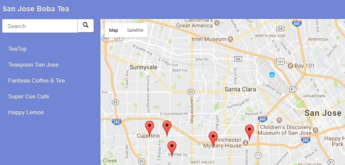

# Project Description

A single page JavaScript application for locating Boba tea shops on a neighborhood map
1. Utilizing Knockout JS and JQuery framework
2. Utilizing Google Map API and Foursquare API
3. Responsive design with Bootstrap CSS
4. Using Model-View-Controller (MVC) design pattern.

## Getting Started

These instructions will get you a copy of the project up and running on your local machine for development and testing purposes.

### Prerequisites

1. Obtain a Google Developer API Key. For detailed instruction, click [here](https://developers.google.com/maps/documentation/embed/get-api-key)
2. Obtain a Foursquare Developer API client id and client secret. For detailed instruction, click [here](https://developer.foursquare.com/)

### Installing the application

1. Download the neighborhood map repository onto your local machine.
2. Find index.html, and replace YOUR_GOOGLE_API_KEY in the file (around line 63) with your actual Google API key, and save the change.
3. Find app.js, and replace YOUR_CLIENT_ID and YOUR_CLIENT_SECRET (around line 63 and 64) with your actual Foursquare API CLIENT_ID and CLIENT_SECRET, and save the change.
   (Do NOT remove the single quotes around YOUR_CLIENT_ID and YOUR_CLIENT_SECRET)

## How to run the application

1. Right click on index.html, open with, Chrome (or other browsers).

## License

None

## Acknowledgements

* https://stackoverflow.com/questions/7339200/bounce-a-pin-in-google-maps-once

